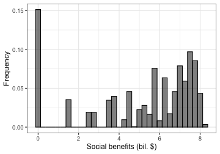
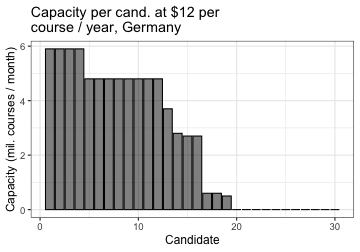

```r
# Loading packages and setting up options
library(vaccineEarlyInvest)
library(ggplot2)
library(data.table)
theme_set(theme_bw(base_size=12))
```

## Simple case: Peru

The main function that finds the optimal portfolio for a price taking country is `portfolioPriceTaker()`. In order to illustrate its basic usage, let's find the optimal portfolio for Peru. It has 31.99 million people, its GDP per capita is $6,710, 13.1% of its population is high risk, and the World Bank projects the Covid-19 pandemic will cause a 26.9% cumulative GDP loss over 2020 and 2021. The main arguments to `portfolioPriceTaker()` are these five numbers, the price at which manufacturing capacity is sold in the market (let's assume it's $10 per course / year), as well as the path to a .csv file with data on vaccine candidates. The file in `inst/extdata/vaccinesSummaryAug20.csv` gives an example of how the input file should look like. It reflects the state of the vaccine landscape in August 20, 2020, with [data from the WHO](https://www.who.int/publications/m/item/draft-landscape-of-covid-19-candidate-vaccines).


```r
population <- 31.99 # In millions
gdp_pc <- 6.71 # In thousand dollars
frac_high_risk <- 0.131
loss2yr <- 0.269
price <- 10 # In dollars per course / year

portfolioPeru <- portfolioPriceTaker(population=population, gdp_pc=gdp_pc, frac_high_risk=frac_high_risk, 
                                     loss2yr=loss2yr, price=price,
                                 candidateFile="../inst/extdata/vaccinesSummarySep9.csv")
#> [1] "Objective function: country net benefits"
#> 1.068466 , 1.460368 , 1.460368 , 
#> [1] "Objective function: country net benefits"
#> 1.554469 , 1.648282 , 1.748535 , 1.838525 , 1.916393 , 1.95346 , 1.980987 , 1.997449 , 2.026447 , 2.050197 , 2.06661 , 2.166213 , 2.261432 , 2.349422 , 2.448133 , 2.542297 , 2.629028 , 2.702507 , 2.775232 , 2.775814 , 2.830428 , 2.889248 , 2.922548 , 2.946051 , 2.9468 , 2.962609 , 2.971601 , 2.977539 , 2.984072 , 2.988172 , 2.994478 , 2.997293 , 3.015927 , 3.018579 , 3.018579 , 
#> [1] "Objective function: country net benefits"
#> 3.019175 , 3.019718 , 3.01999 , 3.020464 , 3.020885 , 3.022001 , 3.023052 , 3.024018 , 3.024435 , 3.024618 , 3.024746 , 3.025591 , 3.026106 , 3.026549 , 3.026896 , 3.027167 , 3.02734 , 3.027455 , 3.027501 , 3.027539 , 3.027569 , 3.027614 , 3.027944 , 3.027994 , 3.028021 , 3.02805 , 3.028201 , 3.028222 , 3.028222 ,
```

Note that the names of all six arguments must be entered explicitly when calling `portfolioPriceTaker()`. The output from this function is a list that includes the main information about the optimal portfolio:


```r
portfolioPeru$expBenefits # In billion dollars
#> [1] 5.068222
portfolioPeru$cost # In billion dollars
#> [1] 2.04
portfolioPeru$totCapacity # In million courses / month
#> [1] 17

# Sorting capacities in descending order
capacities <- sort(portfolioPeru$capacities, decreasing=T)

ggplot() + geom_bar(aes(1:length(capacities), capacities), stat="identity",
                    fill="black", color="black", alpha=0.5) +
  labs(x="Candidate", y="Capacity (mil. courses / month)", 
       title="Capacity per cand. at $10 per\ncourse / year, Peru")
```


The next two figures show the distribution of the effective capacity and of net benefits obtained with the optimal portfolio.


```r
distribution <- portfolioPeru$distribution

ggplot() + geom_histogram(aes(capacity, weight=prob), distribution,
                          binwidth=0.5, fill="black", color="black", alpha=0.5) +
  labs(x="Production capacity (mil. courses / month)", y="Frequency") + 
  coord_cartesian(xlim=c(0,15))
```


```r

ggplot() + geom_histogram(aes(socialBenefit, weight=prob), distribution,
                          binwidth=0.25, fill="black", color="black", alpha=0.5) +
  labs(x="Social benefits (bil. $)", y="Frequency")
```



#### Full demand curve

The function `demandPriceTaker()` finds the whole demand curve for a country for different prices. It is much more efficient than calling `portfolioPriceTaker()` multiple times at different prices. Here is an example of how to call that function and plot total demand for manufacturing capacity for Peru:


```r
prices <- 1:30 # Vector of prices at which demand will be evaluated

demandPeru <- demandPriceTaker(population=population, gdp_pc=gdp_pc, frac_high_risk=frac_high_risk, 
                                     loss2yr=loss2yr, prices=prices,
                                 candidateFile="../inst/extdata/vaccinesSummarySep9.csv")

ggplot() + geom_line(aes(totalCapacity, price), demandPeru$optimizations) + 
  labs(x="Capacity (mil. courses / month)", y="Price ($ per course / year)", 
       title="Demand curve, Peru")
```


#### Limited budget

The function `limBudgetPriceTaker()` finds the optimal portfolio for a country with a limited budget. It takes as an input a vector `shadowCosts` that refers to different levels of the cost of public funds, and computes the optimal portfolio for each value of the shadow cost. The following example shows how this function can be used to compute the benefits and net benefits that can be obtained at every level of expenditure:


```r
shadowCosts <- seq(1,5,0.1)  # Vector of shadow costs: cost of public funds

limBudgetPeru <- limBudgetPriceTaker(population=population, gdp_pc=gdp_pc, frac_high_risk=frac_high_risk, 
                                     loss2yr=loss2yr, shadowCosts=shadowCosts, price=10,
                                 candidateFile="../inst/extdata/vaccinesSummarySep9.csv")

plotdata <- melt(limBudgetPeru$optimizations[, .(cost, expBenefit, netBenefit=expBenefit-cost)],
                 id.vars="cost", measure.vars=c("expBenefit", "netBenefit"))
plotdata[variable=="expBenefit", label := "Benefits"]
plotdata[variable=="netBenefit", label := "Net Benefits"]

ggplot() + geom_line(aes(cost, value, color=label), plotdata) +
  scale_color_brewer(palette="Set1") +
  labs(x="Cost (bil. $)", y="Benefits (bil. $)", color=NULL, title="Limited budget, Peru")
```


## Advanced options

The previous simple analysis uses the default parameters of the model. Those default parameters can be modified by passing an object of the `Parameters` class (an `R6` class). In that case, the input arguments `population`, `gdp_pc`, `frac_high_risk`, and `loss2yr` passed to `portfolioPriceTaker()` and `demandPriceTaker()` are overriden. Instead, they should be passed as arguments to the constructor of the `Parameters` class.

As an example, let's find the optimal portfolio for Germany at a price of $12 per course / year, but let's now assume that the probability that vaccine candidates in phase 2 are successful is 0.5 (instead of 0.32), that the expected fraction of harm that will be mitigated because of alternative treatments is 0.7 (instead of 0.5), and that worldwide mortality is 500,000 people per month (instead of 200,000 per month).


```r
# Parameters for Germany
population <- 83.02 # In millions
gdp_pc <- 47.6 # In thousand dollars
frac_high_risk <- 0.297
loss2yr <- 0.170
price <- 12 # In dollars per course / year

# Alternative model parameters
pphase2 <- 0.5
sharm <- 0.7
worldmortality <- 500000 # Monthly deaths

parameters <- Parameters$new(population=population, gdp_pc=gdp_pc, 
                             frac_high_risk=frac_high_risk, loss2yr=loss2yr,
                             pphase2=pphase2, sharm=sharm, worldmortality=worldmortality)

portfolioGermany <- portfolioPriceTaker(parameters, price=price,
                                     candidateFile="../inst/extdata/vaccinesSummarySep9.csv")
#> [1] "Objective function: country net benefits"
#> 11.25136 , 19.72368 , 26.00028 , 30.1296 , 32.25973 , 34.1566 , 35.44903 , 36.05811 , 36.07756 , 36.07756 , 
#> [1] "Objective function: country net benefits"
#> 36.11164 , 36.1554 , 36.18673 , 36.21281 , 36.27096 , 36.29581 , 36.31912 , 36.35234 , 36.40516 , 36.49385 , 36.50674 , 36.58156 , 36.65121 , 36.66101 , 36.71694 , 36.76882 , 36.81086 , 36.84118 , 36.86827 , 36.9322 , 36.98639 , 37.00891 , 37.05355 , 37.1116 , 37.15922 , 37.18391 , 37.22166 , 37.2481 , 37.28912 , 37.3171 , 37.34928 , 37.3706 , 37.40941 , 37.43596 , 37.47021 , 37.49135 , 37.49749 , 37.53044 , 37.55024 , 37.58474 , 37.60049 , 37.62821 , 37.63799 , 37.66037 , 37.68327 , 37.69103 , 37.72258 , 37.74074 , 37.77504 , 37.79636 , 37.82314 , 37.8318 , 37.87264 , 37.90144 , 37.91648 , 37.94874 , 37.96222 , 37.97316 , 37.97557 , 37.994 , 37.99878 , 38.01415 , 38.01429 , 38.02495 , 38.02527 , 38.03177 , 38.03998 , 38.0695 , 38.08038 , 38.08081 , 38.08251 , 38.08314 , 38.08367 , 38.10543 , 38.10957 , 38.122 , 38.13361 , 38.14267 , 38.14359 , 38.14484 , 38.1459 , 38.15404 , 38.15513 , 38.15513 , 
#> [1] "Objective function: country net benefits"
#> 38.15574 , 38.15604 , 38.15662 , 38.15687 , 38.15741 , 38.15789 , 38.15836 , 38.1585 , 38.15905 , 38.15918 , 38.15941 , 38.15979 , 38.16015 , 38.16052 , 38.16123 , 38.16154 , 38.16221 , 38.16253 , 38.16284 , 38.1634 , 38.16389 , 38.16408 , 38.16425 , 38.16482 , 38.16522 , 38.16554 , 38.16583 , 38.16612 , 38.16631 , 38.16648 , 38.16676 , 38.1669 , 38.16713 , 38.16723 , 38.16745 , 38.16752 , 38.16767 , 38.16769 , 38.16792 , 38.16817 , 38.16825 , 38.16833 , 38.16861 , 38.16873 , 38.1689 , 38.169 , 38.16902 , 38.16909 , 38.16912 , 38.16913 , 38.16913 ,

# Sorting capacities in descending order
capacities <- sort(portfolioGermany$capacities, decreasing=T)
ggplot() + geom_bar(aes(1:length(capacities), capacities), stat="identity",
                    fill="black", color="black", alpha=0.5) +
  labs(x="Candidate", y="Capacity (mil. courses / month)", 
       title="Capacity per cand. at $12 per\ncourse / year, Germany")
```



A `Parameters` object can also be passed in the same way to `demandPriceTaker()` (instead of specifying the population, GDP per capita, fraction of high risk population, and 2-year economic loss arguments).


#### Modifying parameters directly

The code above shows how to run the model using only simple demographics as model inputs. The `Parameters` constructor computes the main model parameters from those inputs.

It is also possible to enter those main model parameters directly, by passing them as arguments to `Parameters$new()`. This is an exhaustive list of all the model parameters that are used to compute the optimal portfolio for a country:

1. `TT`: The number of periods that early capacity investment is able to accelerate vaccination. 6 months by default.
2. `poverall`: Probability that no problem at the overall level prevents vaccine feasibility. 0.9 by default.
3. `pvector`: Probability that there's no problem at the viral vector platform level. 0.8 by default.
4. `psubunit`: Probability that there's no problem at the protein subunit platform level. 0.8 by default.
5. `prna`: Probability that there's no problem at the RNA platform level. 0.6 by default.
6. `pdna`: Probability that there's no problem at the DNA platform level. 0.4 by default.
7. `pattenuated`: Probability that there's no problem at the live attenuated platform level. 0.8 by default.
8. `pinactivated`: Probability that there's no problem at the inactivated platform level. 0.8 by default
9. `ppreclinical`: Probability that there's no problem at the candidate level when a vaccine is in preclincal trials. 0.14 by default.
10. `pphase1`: Probability that there's no problem at the candidate level when a vaccine is in phase 1 trials. 0.23 by default.
11. `pphase2`: Probability that there's no problem at the candidate level when a vaccine is in phase 2 trials. 0.32 by default.
12. `pphase3`: Probability that there's no problem at the candidate level when a vaccine is in phase 3 trials. 0.5 by default.
13. `psubcat`: Probability that there's no problem at subcategory level. 0.8 by default.
14. `totmonthben`: Total macroeconomic and health benefits from avoiding one month of the pandemic, in billion dollars per month. The default is computed based on the country population and GDP per capita.
15. `sharm`: Expected share of harm avoided by some drug or other policy. 0.5 by default.
16. `fracneeded`: Fraction of population that must be vaccinated to obtain herd immunity. 0.7 by default.
16. `effpop`: Worldwide population that must be vaccinated to optain herd immunity, in billions. 5.46 billion (70% of the human population) by default.
17. `popshare`: Share of the worldwide population in the country of analysis. Computed from country population by default.
17. `gdpshare`: Share of the worldwide GDP in the country of analysis. Computed from country population and GDP per capita by default.
17. `afterCapacity`: Monthly courses obtained after knowing which candidates succeed. Computed by default as 500 million courses / month split evenly across the world by population.
18. `counterCapacity`: Monthly courses obtained if there is no early investment after knowing which candidates succeed. Computed by default as 500 million courses / month split evenly across the world by population. 
19. `benefitKinks`: List describing the form of the piecewise linear function that determines benefits from vaccination as a fraction of the population vaccinated. It can be set by passing, for instance, `benefitShape=list(c(0.15,0.4,0.7),c(0.6,0.9,1))`, which means that vaccinating 15% of the population gives 60% of the harm, vaccinating 40% of the population gives 90% of the harm, and vaccinating 70% of the population gives 100% of the harm.


As an example of how to enter parameters directly, consider a hypothetical country with 0.05 of the world population and 0.06 of the world GDP, whose monthly harm from Covid is $30 billion. Once it is clear which vaccines succeed, it gets 20 million vaccines per month regardless of whether it invested in them or not. Suppose the country has a simple benefit function in which vaccinating 20% of the population gives 80% of the benefits, and vaccinating 75% gives 100% of the benfits. Also suppose phase 3 candidates have a probability of no idiosyncratic problem of 0.7:


```r
parameters <- Parameters$new(popshare=0.05, gdpshare=0.06, totmonthben=30, pphase3=0.7,
                             afterCapacity=20, counterCapacity=20,
                             benefitKinks=list(c(0.2,0.75),c(0.8,1)))

portfolioCountry <- portfolioPriceTaker(parameters, price=price,
                                     candidateFile="../inst/extdata/vaccinesSummarySep9.csv")
#> [1] "Objective function: country net benefits"
#> 19.49538 , 36.48969 , 47.01998 , 58.53018 , 68.31118 , 71.78337 , 74.86842 , 77.51149 , 81.92256 , 83.15309 , 85.01975 , 85.25928 , 89.69523 , 93.56441 , 93.80117 , 93.99943 , 94.11852 , 94.16066 , 94.19639 , 96.00121 , 97.45641 , 98.52248 , 99.00439 , 99.68286 , 100.0839 , 100.3148 , 100.4862 , 100.5649 , 100.8905 , 100.9294 , 101.6097 , 102.1699 , 102.1958 , 102.5851 , 102.6069 , 103.018 , 103.5816 , 104.0361 , 104.2358 , 104.2417 , 104.2417 , 
#> [1] "Objective function: country net benefits"
#> 104.2507 , 104.266 , 104.2669 , 104.2857 , 104.3037 , 104.3206 , 104.326 , 104.3415 , 104.3462 , 104.3608 , 104.3722 , 104.3827 , 104.392 , 104.4003 , 104.409 , 104.4171 , 104.4198 , 104.4214 , 104.4218 , 104.4228 , 104.4258 , 104.4282 , 104.4284 , 104.438 , 104.4431 , 104.444 , 104.4494 , 104.4508 , 104.4514 , 104.461 , 104.4661 , 104.467 , 104.4676 , 104.4761 , 104.4803 , 104.4845 , 104.4874 , 104.4951 , 104.4986 , 104.4996 , 104.5028 , 104.5076 , 104.508 , 104.5117 , 104.5117 , 
#> [1] "Objective function: country net benefits"
#> 104.5118 , 104.5118 , 104.5118 , 104.512 , 104.5122 , 104.5122 , 104.5122 , 104.5122 , 104.5124 , 104.5125 , 104.5126 , 104.5127 , 104.5128 , 104.5128 , 104.5128 , 104.5129 , 104.5129 , 104.5129 , 104.5129 , 104.513 , 104.5131 , 104.5131 , 104.5131 , 104.5131 , 104.5132 , 104.5133 , 104.5133 , 104.5133 , 104.5133 , 104.5134 , 104.5134 , 104.5134 , 104.5134 , 104.5135 , 104.5135 , 104.5135 , 104.5135 , 104.5136 , 104.5136 , 104.5136 , 104.5136 ,

# Sorting capacities in descending order
capacities <- sort(portfolioCountry$capacities, decreasing=T)
ggplot() + geom_bar(aes(1:length(capacities), capacities), stat="identity",
                    fill="black", color="black", alpha=0.5) +
  labs(x="Candidate", y="Capacity (mil. courses / month)", 
       title="Capacity per cand. at $12 per\ncourse / year, hypothetical country")
```


