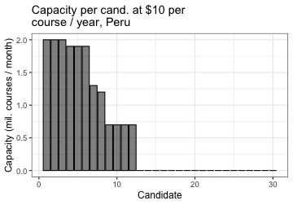
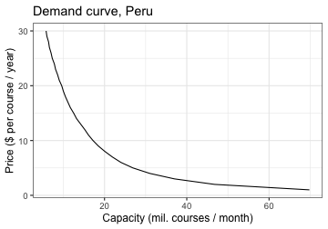

## Finding the optimal portfolio for a country


```r
# Loading packages and setting up options
library(vaccineEarlyInvest)
library(ggplot2)
theme_set(theme_bw(base_size=12))
```

### Simple case: Peru

The main function that finds the optimal portfolio for a price taking country is `portfolioPriceTaker()`. In order to illustrate its basic usage, let's find the optimal portfolio for Peru. It has 31.99 million people, its GDP per capita is $6,710, 13.1% of its population is high risk, and the World Bank projects the Covid-19 pandemic will cause a 26.9% cumulative GDP loss over 2020 and 2021. The main arguments to `portfolioPriceTaker()` are these five numbers, the price at which manufacturing capacity is sold in the market (let's assume it's $10 per course / year), as well as the path to a .csv file with data on vaccine candidates. The file in `inst/extdata/vaccinesSummaryAug20.csv` gives an example of how the input file should look like. It reflects the state of the vaccine landscape in August 20, 2020, with [data from the WHO](https://www.who.int/publications/m/item/draft-landscape-of-covid-19-candidate-vaccines).


```r
population <- 31.99 # In millions
gdp_pc <- 6.71 # In thousand dollars
frac_high_risk <- 0.131
loss2yr <- 0.269
price <- 10 # In dollars per course / year

portfolioPeru <- portfolioPriceTaker(population=population, gdp_pc=gdp_pc, frac_high_risk=frac_high_risk, 
                                     loss2yr=loss2yr, price=price,
                                 candidateFile="../inst/extdata/vaccinesSummaryAug20.csv")
#> [1] "Objective function: country net benefits"
#> 0.8220824 , 1.036274 , 1.036274 , 
#> [1] "Objective function: country net benefits"
#> 1.135713 , 1.234922 , 1.345085 , 1.437955 , 1.484332 , 1.516708 , 1.533346 , 1.558756 , 1.576301 , 1.678745 , 1.777213 , 1.877435 , 1.972677 , 2.063466 , 2.148147 , 2.22541 , 2.292492 , 2.348872 , 2.391439 , 2.420067 , 2.430663 , 2.432501 , 2.448996 , 2.453913 , 2.457225 , 2.457513 , 2.482039 , 2.482039 , 
#> [1] "Objective function: country net benefits"
#> 2.48263 , 2.483586 , 2.484346 , 2.48481 , 2.485238 , 2.485311 , 2.485564 , 2.486404 , 2.486623 , 2.48797 , 2.489268 , 2.490362 , 2.49134 , 2.49217 , 2.492835 , 2.493334 , 2.493823 , 2.494333 , 2.494723 , 2.495043 , 2.495322 , 2.495492 , 2.495516 , 2.49558 , 2.495618 , 2.495618 ,
```

Note that the names of all six arguments must be entered explicitly when calling `portfolioPriceTaker()`. The output from this function is a list that includes the main information about the optimal portfolio:


```r
portfolioPeru$expBenefits # In billion dollars
#> [1] 4.235618
portfolioPeru$cost # In billion dollars
#> [1] 1.74
portfolioPeru$totCapacity # In million courses / month
#> [1] 14.5

# Sorting capacities in descending order
capacities <- sort(portfolioPeru$capacities, decreasing=T)

ggplot() + geom_bar(aes(1:length(capacities), capacities), stat="identity",
                    fill="black", color="black", alpha=0.5) +
  labs(x="Candidate", y="Capacity (mil. courses / month)", 
       title="Capacity per cand. at $10 per\ncourse / year, Peru")
```



The next two figures show the distribution of the effective capacity and of net benefits obtained with the optimal portfolio.


```r
distribution <- portfolioPeru$distribution

ggplot() + geom_histogram(aes(capacity, weight=prob), distribution,
                          binwidth=0.5, fill="black", color="black", alpha=0.5) +
  labs(x="Production capacity (mil. courses / month)", y="Frequency") + 
  coord_cartesian(xlim=c(0,15))
```


```r

ggplot() + geom_histogram(aes(socialBenefit, weight=prob), distribution,
                          binwidth=0.25, fill="black", color="black", alpha=0.5) +
  labs(x="Social benefits (bil. $)", y="Frequency")
```


The function `demandPriceTaker()` finds the whole demand curve for a country for different prices. It is much more efficient than calling `portfolioPriceTaker()` multiple times at different prices. Here is an example of how to call that function and plot total demand for manufacturing capacity for Peru:


```r
prices <- 1:30 # Vector of prices at which demand will be evaluated

demandPeru <- demandPriceTaker(population=population, gdp_pc=gdp_pc, frac_high_risk=frac_high_risk, 
                                     loss2yr=loss2yr, prices=prices,
                                 candidateFile="../inst/extdata/vaccinesSummaryAug20.csv")

ggplot() + geom_line(aes(totalCapacity, price), demandPeru$optimizations) + 
  labs(x="Capacity (mil. courses / month)", y="Price ($ per course / year)", 
       title="Demand curve, Peru")
```




### Advanced options

The previous simple analysis uses the default parameters of the model. Those default parameters can be modified by passing an object of the `Parameters` class (an `R6` class). In that case, the input arguments `population`, `gdp_pc`, `frac_high_risk`, and `loss2yr` passed to `portfolioPriceTaker()` and `demandPriceTaker()` are overriden. Instead, they should be passed as arguments to the constructor of the `Parameters` class.

As an example, let's find the optimal portfolio for Germany at a price of $12 per course / year, but let's now assume that the probability that vaccine candidates in phase 2 are successful is 0.5 (instead of 0.32), that the expected fraction of harm that will be mitigated because of alternative treatments is 0.7 (instead of 0.5), and that worldwide mortality is 500,000 people per month (instead of 200,000 per month).


```r
# Parameters for Germany
population <- 83.02 # In millions
gdp_pc <- 47.6 # In thousand dollars
frac_high_risk <- 0.297
loss2yr <- 0.170
price <- 12 # In dollars per course / year

# Alternative model parameters
pphase2 <- 0.5
sharm <- 0.7
worldmortality <- 500000 # Monthly deaths

parameters <- Parameters$new(population=population, gdp_pc=gdp_pc, 
                             frac_high_risk=frac_high_risk, loss2yr=loss2yr,
                             pphase2=pphase2, sharm=sharm, worldmortality=worldmortality)

portfolioGermany <- portfolioPriceTaker(parameters, price=price,
                                     candidateFile="../inst/extdata/vaccinesSummaryAug20.csv")
#> [1] "Objective function: country net benefits"
#> 10.68323 , 18.48803 , 24.10161 , 27.63657 , 29.3706 , 30.83583 , 31.7645 , 32.08334 , 32.08334 , 
#> [1] "Objective function: country net benefits"
#> 32.12445 , 32.17489 , 32.21354 , 32.24735 , 32.29694 , 32.32961 , 32.3609 , 32.40171 , 32.42388 , 32.4739 , 32.54914 , 32.61909 , 32.62398 , 32.65257 , 32.70448 , 32.73667 , 32.77069 , 32.79122 , 32.84013 , 32.84097 , 32.90458 , 32.95783 , 32.99844 , 33.03262 , 33.08092 , 33.11715 , 33.1562 , 33.17627 , 33.19957 , 33.23519 , 33.25123 , 33.27079 , 33.27261 , 33.31748 , 33.34111 , 33.36035 , 33.39402 , 33.41349 , 33.45662 , 33.47808 , 33.51441 , 33.53685 , 33.56756 , 33.57788 , 33.58534 , 33.5916 , 33.60638 , 33.60821 , 33.62548 , 33.64054 , 33.65317 , 33.67732 , 33.68618 , 33.6872 , 33.70322 , 33.71112 , 33.71448 , 33.71488 , 33.7151 , 33.71604 , 33.72003 , 33.72709 , 33.7303 , 33.73295 , 33.73295 , 
#> [1] "Objective function: country net benefits"
#> 33.73329 , 33.73374 , 33.73438 , 33.73459 , 33.73514 , 33.73547 , 33.73608 , 33.73648 , 33.73673 , 33.73726 , 33.73753 , 33.73809 , 33.73889 , 33.73908 , 33.73957 , 33.74033 , 33.74051 , 33.74111 , 33.74169 , 33.74215 , 33.74256 , 33.74301 , 33.74342 , 33.74382 , 33.74409 , 33.74428 , 33.7444 , 33.74469 , 33.74491 , 33.74503 , 33.7452 , 33.7455 , 33.74575 , 33.74585 , 33.74624 , 33.74646 , 33.74673 , 33.74677 , 33.74686 , 33.74701 , 33.74705 , 33.74706 , 33.74722 , 33.74751 , 33.74763 , 33.74774 , 33.74774 , 33.74775 , 33.74775 ,

# Sorting capacities in descending order
capacities <- sort(portfolioGermany$capacities, decreasing=T)
ggplot() + geom_bar(aes(1:length(capacities), capacities), stat="identity",
                    fill="black", color="black", alpha=0.5) +
  labs(x="Candidate", y="Capacity (mil. courses / month)", 
       title="Capacity per cand. at $12 per\ncourse / year, Germany")
```


A `Parameters` object can also be passed in the same way to `demandPriceTaker()` (instead of specifying the population, GDP per capita, fraction of high risk population, and 2-year economic loss arguments).
